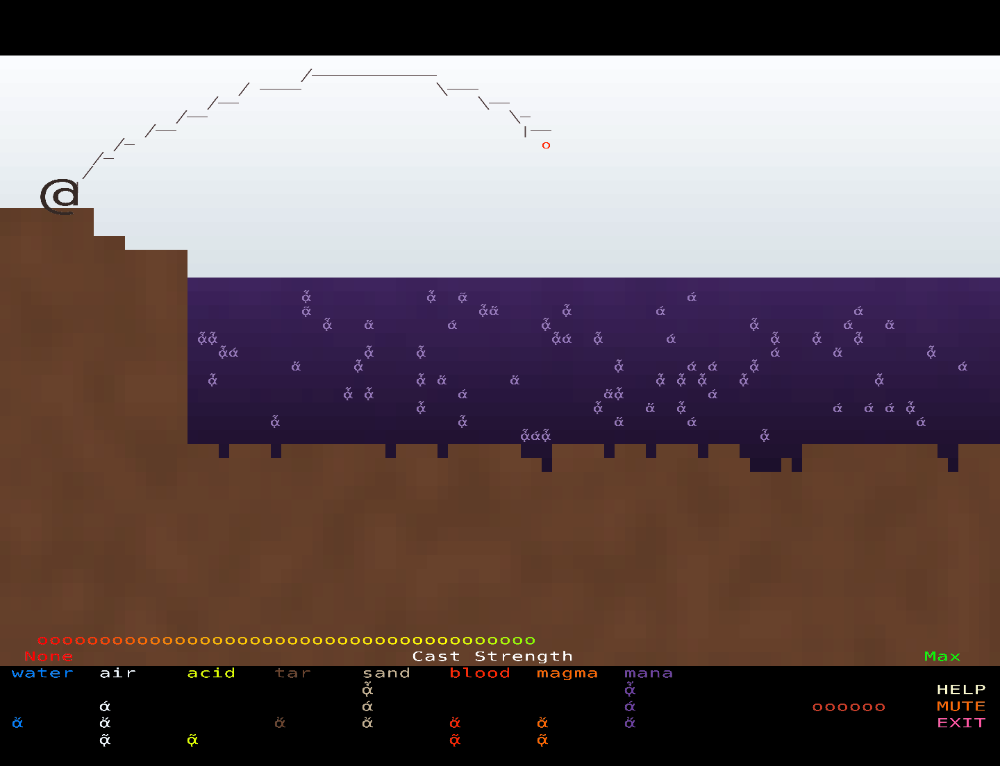

# Assault Fish

<p align="center"><strong>A tactical roguelike where fishing is your weapon.</strong></p>

<p align="center">
Catch elemental fish from magic pools, then throw them to reshape terrain, trigger reactions, and wipe out monsters that you cannot fight head-on.
</p>

<table>
	<tr>
		<td></td>
		<td></td>
	</tr>
	<tr>
		<td><em>Explore the map, manage positioning, and set up elemental attacks.</em></td>
		<td><em>Cast into pools to catch the fish that power every attack.</em></td>
	</tr>
</table>

## Why It Stands Out

- Turn-based roguelike tactics with elemental chain reactions.
- No direct melee damage; fish are your entire combat system.
- Fishing and combat are tightly linked, so every pool matters.
- Different fish sizes change blast radius and tactical reach.

## How To Play

Defeat every elemental monster on the map.

1. Explore until you find an elemental pool.
2. Fish to stock up on throwable elemental ammo.
3. Pick the right fish for the terrain and enemy type.
4. Throw carefully to trigger the reactions you want.

## Controls

- Move: Arrow keys, `WASD`, or `HJKL`
- Move / target fish throw: Left Click
- Cancel selection / stop fishing: Right Click
- Inspect tile: Ctrl + Left Click or Middle Click
- Help: `H`
- Exit: `ESC`
- Screenshot: `P`
- Animated GIF recording: `V`

## Run

Requires Java 25+.

```bash
./gradlew lwjgl3:run
```

Build the desktop jar:

```bash
./gradlew lwjgl3:build
java -jar lwjgl3/build/libs/AssaultFish-2.0.0.jar
```

Optional HTML/GWT target:

```bash
./gradlew html:dist -PincludeHtml=true
```

## License

See [LICENSE](LICENSE).
