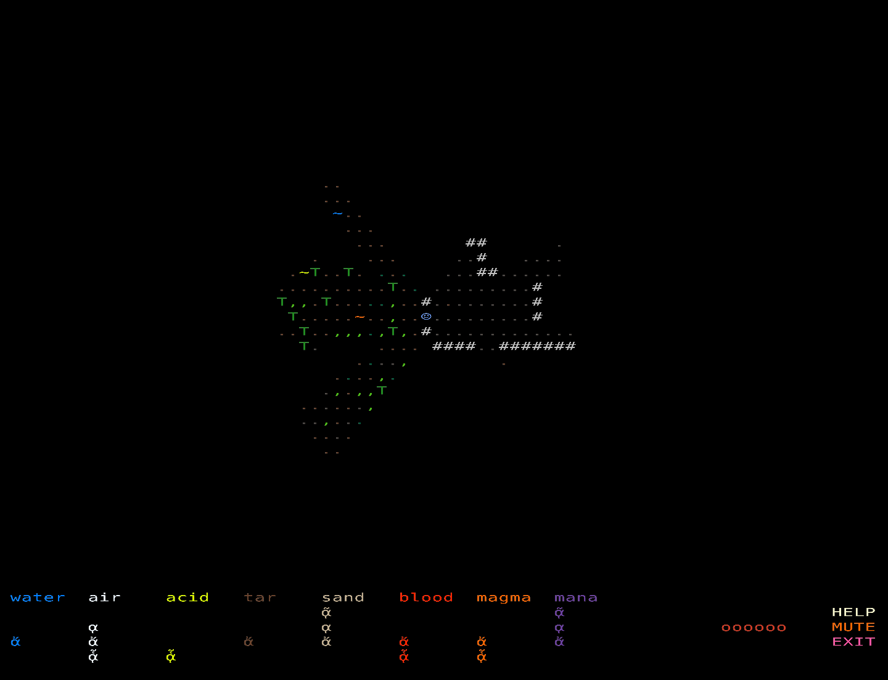

# Assault Fish

Assault Fish is a tactical roguelike where you survive an elemental invasion by doing what you do best: fishing.

Catch explosive elemental fish from magical pools, then throw them to transform terrain, trigger reactions, and eliminate monsters.



## What This Game Is

- A turn-based grid roguelike with elemental interactions.
- You cannot directly damage enemies in melee.
- Your primary weapon is fish you catch, select, and throw.
- Different fish sizes create different blast radii.

## How to Play

### Goal

Defeat every elemental monster on the map.

### Core Loop

1. Move around the map and find elemental pools.
2. Step into a pool to enter fishing mode.
3. Time your cast to catch fish.
4. Select fish from your inventory.
5. Throw fish to alter terrain and destroy enemies via elemental counters.

## Controls

### Map

- Move: Arrow keys, `WASD`, or `HJKL`
- Inspect tile: Ctrl + Left Click (or Middle Click)
- Select fish target / move: Left Click
- Deselect fish: Right Click

### Fishing

- Start cast meter: Left Click
- Release cast: Left Click
- Stop fishing: Right Click

### UI / System

- Help: `H` or `HELP` button
- Toggle music: `MUTE` button
- Exit: `ESC` or `EXIT` button
- Screenshot: `P` (saved to `screenshots/`)

## Run Locally

### Requirements

- Java 25+

### Quick start

```bash
./gradlew lwjgl3:run
```

### Build desktop jar

```bash
./gradlew lwjgl3:build
java -jar lwjgl3/build/libs/AssaultFish-2.0.0.jar
```

## Project Notes

- Desktop launcher: `com.squidpony.assaultfish.lwjgl3.Lwjgl3Launcher`
- Core gameplay code: `core/src/main/java/com/squidpony/assaultfish/AssaultFish.java`
- Legacy HTML/GWT target is optional: enable with `-PincludeHtml=true`

## License

See [LICENSE](LICENSE).
